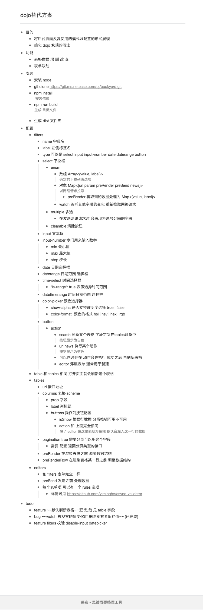

# backyard

> 替代后台dojo展示页面

## Build Setup

安装 [Nodejs](https://nodejs.org/)

``` bash
# 安装依赖
npm install

# 开发模式 包含假数据
npm run dev

# 生成 目标文件
npm run build
```

## 框架

前端框架使用 [Vue](https://cn.vuejs.org/)
UI框架使用 [Element-UI](http://element.eleme.io/)

## 参数配置



[文字版](doc.md)
